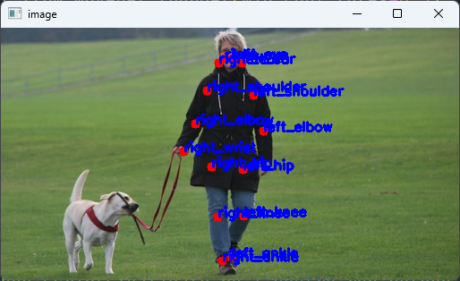

# Human Validation Lib

## Installation

**Requirements**

- PEP 517 compatible build system (pip should work)
- poetry-core>=1.1.0a6 compatible environment

Tested with

- Python 3.6 + pip 21.3.1

- Python 3.8  + pip 23.2.1

- Docker nvcr.io/nvidia/l4t-ml:r35.1.0-py3

Install the base lib in the virtual environment:

```bash
git clone https://github.com/JorgeRuizITCL/human-validation
pip install human-validation
rm -r human-validation
```

**Install ONNX Runtime**:

### CPU

```bash
pip install onnxruntime>=1.10
```

### Jetpack

ONNX Runtime Jetpack builds / wheels can be found [here](https://elinux.org/Jetson_Zoo#ONNX_Runtime).
Each Jetson device requires an specific ONNX Runtime wheel, and it depends on:

- Python version (3.6-3.11)

- Jetpack version (can be checked with `sudo apt-cache show nvidia-jetpack`)

- CUDA version. Onnx is compiled for an specific CUDA version. Nvidia has not shared the specific CUDA version that each ONNX build requires, but it should be the same as the one preinstalled in the desired Jetpack version.

> [!IMPORTANT]
> The following snippet only works for Python 3.8 + Jetpack 5.1.1 + Cuda 11

```bash
# Example
wget --content-disposition https://nvidia.box.com/shared/static/mvdcltm9ewdy2d5nurkiqorofz1s53ww.whl
python3 -m pip install onnxruntime_gpu-1.15.1-cp38-cp38-linux_aarch64.whl
```

## Usage

```python
from human_val import Validator
from PIL import Image
import requests
import numpy as np

URL = "https://images.pexels.com/photos/1018911/pexels-photo-1018911.jpeg"
img = Image.open(requests.get(URL, stream=True).raw)
arr = np.array(img)

val = Validator.from_movenet_thunder(min_conf_thres=0.5)
joints, is_human = val.validate(arr, min_joints=12)
print(is_human)
print(joints)
```

### Run Example

> [!IMPORTANT]
> The following code requires the package to be installed with dev-dependencies in the virtual environment (`poetry install -G dev`).

```bash
poetry run python scripts/validate.py | poetry run python scripts/visualize.py
```

Example output:



### Parameters

- Model: Movenet Thunder (higher score) & Movenet Lightning (fastest)
- Score Threshold: Minimun score to consider a joint visible. Defaults to 0.5, depends on the model and some examples use 0.25 and others 0.12.
- Validate min joints: Minimum number of visible joints to consider that a human is in the frame.

### Docker Image

```bash
docker build -t humanval:latest -f Dockerfile.r35 .
docker run -it --rm --runtime nvidia --gpus all humanval:latest
```

### Testing

```bash
poetry run pytest .
```
